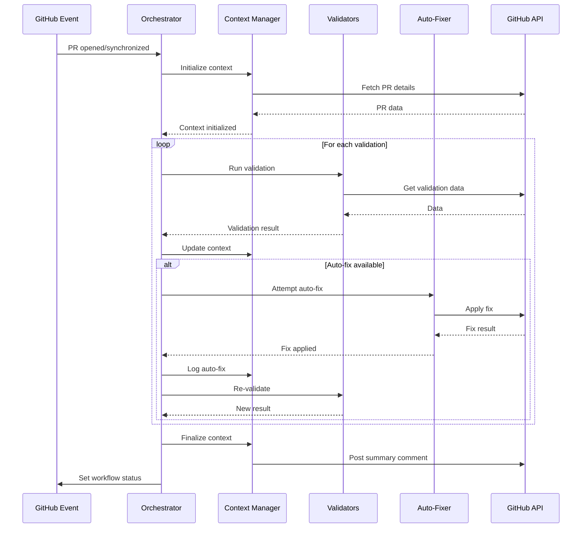

# STREAM A Orchestrator Design

## Overview

STREAM Aオーケストレーターは、9つの独立したワークフローを統合し、コンテキスト共有、自動修正、ハードブロック機能を提供します。

## Command Interface

### Basic Usage

```bash
@claude --workflow=stream-a --pr=<PR_NUMBER> [OPTIONS]
```

### Parameters

| Parameter | Required | Default | Description |
|-----------|----------|---------|-------------|
| `--workflow` | Yes | - | ワークフロー名（stream-a, stream-b, stream-c） |
| `--pr` | Yes | - | Pull Request番号 |
| `--mode` | No | `orchestrate` | 実行モード（orchestrate, validate, auto-fix） |
| `--auto-fix` | No | `true` | 自動修正を有効化 |
| `--hard-block` | No | `false` | ハードブロックモード（Phase 2） |
| `--context-file` | No | `/tmp/stream-a-context.json` | コンテキストファイルのパス |
| `--verbose` | No | `false` | 詳細ログ出力 |

### Execution Modes

#### 1. `orchestrate` (Default)
全ての検証を順次実行し、自動修正を試みる

```bash
@claude --workflow=stream-a --pr=123 --mode=orchestrate
```

#### 2. `validate`
検証のみ実行（修正なし）

```bash
@claude --workflow=stream-a --pr=123 --mode=validate
```

#### 3. `auto-fix`
検出された問題の自動修正のみ実行

```bash
@claude --workflow=stream-a --pr=123 --mode=auto-fix
```

## Shared Context Schema

### Context File Structure

```json
{
  "version": "1.0.0",
  "workflow": "stream-a",
  "pr": {
    "number": 123,
    "title": "feat: Add orchestrator system",
    "branch": "feature/20-orchestrator",
    "base": "main",
    "head_sha": "abc1234",
    "author": "hiranotomo",
    "created_at": "2025-11-24T10:00:00Z",
    "issue_reference": 20
  },
  "validations": {
    "branch_name": {
      "status": "pass",
      "checked_at": "2025-11-24T10:01:00Z",
      "message": "Branch name follows convention",
      "details": {
        "pattern": "feature/20-orchestrator",
        "type": "feature",
        "issue_number": 20,
        "description": "orchestrator"
      },
      "auto_fix_available": false
    },
    "commit_message": {
      "status": "fail",
      "checked_at": "2025-11-24T10:01:30Z",
      "message": "2 commits missing issue reference",
      "details": {
        "total_commits": 5,
        "valid_commits": 3,
        "invalid_commits": [
          {
            "sha": "abc1234",
            "message": "Add orchestrator",
            "reason": "No issue reference"
          },
          {
            "sha": "def5678",
            "message": "Update tests",
            "reason": "No issue reference"
          }
        ]
      },
      "auto_fix_available": true,
      "auto_fix_strategy": "amend_commit_message"
    },
    "pr_files": {
      "status": "warning",
      "checked_at": "2025-11-24T10:02:00Z",
      "message": "No test files changed",
      "details": {
        "source_files_changed": 3,
        "test_files_changed": 0,
        "files": [
          ".github/workflows/stream-a-orchestrator.yml",
          "src/orchestrator.ts",
          "docs/orchestrator.md"
        ]
      },
      "auto_fix_available": false
    },
    "dod_checklist": {
      "status": "warning",
      "checked_at": "2025-11-24T10:02:30Z",
      "message": "4 DoD items unchecked",
      "details": {
        "issue_number": 20,
        "issue_title": "STREAM A Orchestrator",
        "total_checkboxes": 11,
        "checked_checkboxes": 7,
        "unchecked_checkboxes": 4,
        "unchecked_items": [
          "Test orchestrator with passing PR scenario",
          "Test orchestrator with failing PR scenario",
          "Document orchestrator architecture in Wiki",
          "Create usage guide for @claude --workflow"
        ]
      },
      "auto_fix_available": false
    },
    "workflow_syntax": {
      "status": "pass",
      "checked_at": "2025-11-24T10:03:00Z",
      "message": "All workflow files valid",
      "details": {
        "actionlint_errors": 0,
        "yamllint_errors": 0
      },
      "auto_fix_available": false
    },
    "conflicts": {
      "status": "pass",
      "checked_at": "2025-11-24T10:03:30Z",
      "message": "No merge conflicts",
      "details": {
        "mergeable": true,
        "mergeable_state": "clean"
      },
      "auto_fix_available": false
    },
    "ci": {
      "status": "pending",
      "checked_at": "2025-11-24T10:04:00Z",
      "message": "CI checks running",
      "details": {
        "lint": "pending",
        "test": "pending",
        "build": "pending"
      },
      "auto_fix_available": false
    }
  },
  "auto_fixes_applied": [
    {
      "validation": "commit_message",
      "timestamp": "2025-11-24T10:05:00Z",
      "strategy": "amend_commit_message",
      "changes": [
        {
          "commit_sha": "abc1234",
          "before": "Add orchestrator",
          "after": "feat: Add orchestrator (#20)"
        },
        {
          "commit_sha": "def5678",
          "before": "Update tests",
          "after": "test: Update tests (#20)"
        }
      ],
      "result": "success"
    }
  ],
  "summary": {
    "total_validations": 7,
    "passed": 4,
    "failed": 1,
    "warnings": 2,
    "pending": 1,
    "auto_fixes_attempted": 1,
    "auto_fixes_succeeded": 1,
    "final_status": "warning",
    "can_merge": true,
    "blocking_issues": []
  },
  "metadata": {
    "orchestrator_version": "1.0.0",
    "execution_time_ms": 45000,
    "token_usage": 12500,
    "model": "claude-sonnet-4-5"
  }
}
```

### Status Values

- `pass`: 検証成功
- `fail`: 検証失敗（ブロッキング）
- `warning`: 警告（非ブロッキング）
- `pending`: 検証中
- `skipped`: スキップ

## Auto-Fix Strategies

### Phase 1: Basic Auto-Fixes

#### 1. Branch Name Normalization
```json
{
  "validation": "branch_name",
  "strategy": "normalize_branch_name",
  "condition": "Branch name close to valid pattern",
  "actions": [
    "Extract issue number from PR title/body",
    "Normalize description (lowercase, replace spaces with hyphens)",
    "Create new branch with correct format",
    "Cherry-pick commits"
  ],
  "example": {
    "before": "add-orchestrator",
    "after": "feature/20-add-orchestrator"
  }
}
```

#### 2. Commit Message Formatting
```json
{
  "validation": "commit_message",
  "strategy": "amend_commit_message",
  "condition": "Commits missing issue reference",
  "actions": [
    "Extract issue number from branch name",
    "Detect commit type (feat/fix/docs/test)",
    "Amend commit message with issue reference",
    "Force push with lease"
  ],
  "example": {
    "before": "Add orchestrator",
    "after": "feat: Add orchestrator (#20)"
  }
}
```

### Phase 2: Advanced Auto-Fixes (Future)

#### 3. DoD Checkbox Updates
```json
{
  "validation": "dod_checklist",
  "strategy": "update_dod_checkboxes",
  "condition": "Work completed but checkboxes unchecked",
  "actions": [
    "Detect completed work (tests passing, docs updated)",
    "Update Issue body via GitHub API",
    "Check corresponding DoD items"
  ]
}
```

#### 4. Test File Generation
```json
{
  "validation": "pr_files",
  "strategy": "generate_test_files",
  "condition": "Source changed but no test files",
  "actions": [
    "Analyze changed source files",
    "Generate corresponding test files",
    "Create commit with test files"
  ]
}
```

## Orchestration Flow



## Integration with Existing Workflows

### Workflow Mapping

| Existing Workflow | Orchestrator Module | Auto-Fix Support |
|-------------------|---------------------|------------------|
| `validate-branch-name` | `branch_name` validator | ✅ Yes (Phase 1) |
| `validate-commit-message` | `commit_message` validator | ✅ Yes (Phase 1) |
| `validate-pr-files` | `pr_files` validator | ⏳ Future (Phase 2) |
| `validate-pr-files` (DoD) | `dod_checklist` validator | ⏳ Future (Phase 2) |
| `validate-workflow-syntax` | `workflow_syntax` validator | ❌ No |
| `conflict-detector` | `conflicts` validator | ❌ No |
| `ci` | `ci` validator | ❌ No |
| `auto-dod-judgment` | Integrated into context | N/A |
| `enable-auto-merge` | Post-orchestration | N/A |
| `post-merge-verification` | Post-merge | N/A |

### Transition Strategy

1. **Phase 1**: Orchestrator runs in parallel with existing workflows
   - Existing workflows remain active
   - Orchestrator provides enhanced features
   - Compare results for validation

2. **Phase 2**: Gradual migration
   - Disable individual workflows one by one
   - Orchestrator becomes primary validation system
   - Keep fallback for critical checks

3. **Phase 3**: Complete replacement
   - All validations run through orchestrator
   - Existing workflows archived
   - Orchestrator as single source of truth

## Error Handling

### Infrastructure Errors
```json
{
  "error_type": "infrastructure",
  "validation": "commit_message",
  "message": "GitHub API timeout",
  "action": "skip_validation",
  "retry": true,
  "max_retries": 3
}
```

### Validation Errors
```json
{
  "error_type": "validation_failure",
  "validation": "branch_name",
  "message": "Branch name invalid",
  "action": "attempt_auto_fix",
  "blocking": true
}
```

### Auto-Fix Errors
```json
{
  "error_type": "auto_fix_failure",
  "validation": "commit_message",
  "message": "Cannot amend protected commit",
  "action": "fallback_to_manual",
  "blocking": false
}
```

## Performance Considerations

### Parallel Execution
- Independent validations run in parallel
- Dependent validations run sequentially
- Context updates are atomic

### Caching
- Context file cached for re-runs
- Validation results cached for 5 minutes
- GitHub API responses cached when possible

### Token Optimization
- Use lightweight models for simple validations
- Only invoke Claude for complex auto-fixes
- Batch similar operations

## Security

### Permissions Required
```yaml
permissions:
  contents: write  # For auto-fix commits
  pull-requests: write  # For comments
  issues: write  # For DoD updates
  checks: write  # For status updates
```

### Safe Operations
- Use `--force-with-lease` for force pushes
- Verify commit authorship before amending
- Never push to protected branches without approval
- Audit log all auto-fixes

## References

- [Event Model v1 Design](/.github/docs/EVENT_MODEL_V1.md)
- [STREAM A Architecture Wiki](/tmp/workflow-architecture-wiki.md)
- [GitHub Actions Best Practices](https://docs.github.com/en/actions/security-guides/security-hardening-for-github-actions)

---

**Version**: 1.0.0
**Last Updated**: 2025-11-24
**Status**: Design Phase
