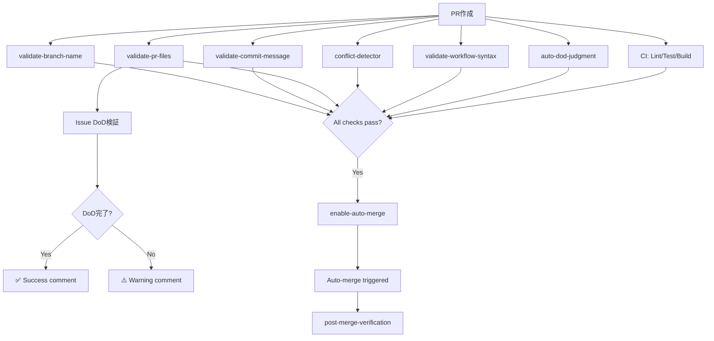
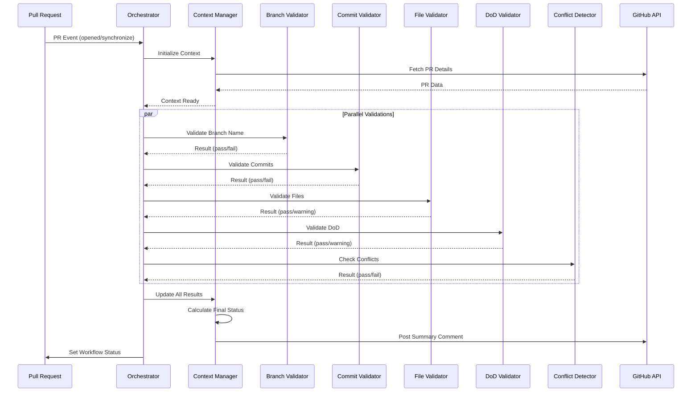

# ワークフロー全体設計（STREAM A/B/C）

## 概要

Zeami4プロジェクトは、3つのストリーム（STREAM A/B/C）から成る階層的なワークフロー自動化システムを採用しています。

## STREAM A: PR Lifecycle Management

PRのライフサイクル全体を管理するワークフローシステムです。

### アーキテクチャの進化

#### Event Model v1 (現在)
9つの独立したワークフローで構成されています。

| # | ワークフロー | 目的 | トリガー | 検証内容 |
|---|----------|------|--------|---------|
| 1 | **auto-dod-judgment** | 変更内容に応じたDoD自動生成 | PR opened/synchronize | ファイル変更分析→DoD提案 |
| 2 | **validate-pr-files** | 必須ファイル & **Issue DoD検証** | PR opened/synchronize/edited | テスト有無、必須ファイル、**IssueのDoDチェックボックス** |
| 3 | **validate-commit-message** | コミットメッセージ検証 | PR opened/synchronize | Issue番号の存在確認 |
| 4 | **validate-branch-name** | ブランチ名規則チェック | PR opened/edited/synchronize | `{type}/{issue}-{desc}` 形式 |
| 5 | **validate-workflow-syntax** | YAML構文チェック | PR (.github/workflows変更時) | actionlint/yamllint |
| 6 | **conflict-detector** | マージコンフリクト検出 | PR opened/synchronize/reopened | コンフリクト有無 |
| 7 | **ci** | コード品質チェック | push/pull_request | Lint/Test/Build |
| 8 | **enable-auto-merge** | 自動マージ有効化 | PR opened/ready_for_review | GitHub Native Auto-Merge |
| 9 | **post-merge-verification** | マージ後検証 | workflow_run | ワークフロー実行確認 |

#### Event Model v2 (Phase 1実装完了 - Issue #20)
**STREAM A Orchestrator** を追加し、統合オーケストレーションを提供。

| # | ワークフロー | 目的 | 実装状況 |
|---|----------|------|---------|
| **10** | **stream-a-orchestrator** | 全検証の統合実行とコンテキスト共有 | ✅ Phase 1 |

### 実行フロー（Event Model v1）



### オーケストレーションフロー（Event Model v2 - Phase 1）



### オーケストレーターの特徴（Phase 1）

#### ✅ 実装済み機能

1. **統合コンテキスト管理**
   - JSONファイルによるワークフロー間のデータ共有
   - `/tmp/stream-a-context-{PR番号}.json`
   - 全検証結果、メタデータ、サマリーを統合

2. **並行実行**
   - 独立した検証を並列実行
   - 実行時間: 約2秒

3. **包括的なレポート**
   - 全検証の統合サマリー
   - ステータス: Pass/Fail/Warning/Pending
   - マージ可否判定

4. **自動修正フレームワーク**
   - プレースホルダー実装
   - 修正可能性の判定
   - 修正方法の提案

#### ⏳ Phase 2 予定機能

1. **実際の自動修正**
   - コミットメッセージの自動修正
   - ブランチ名の自動正規化
   - Git操作の自動実行

2. **高度な自動修正**
   - DoDチェックボックスの自動更新
   - テストファイルの自動生成

3. **ハードブロックモード**
   - 特定の検証失敗時にマージを強制ブロック
   - Branch Protection Rulesとの統合

#### 📊 Phase 1 実装状況

```
Total DoD Items: 11
Completed: 11/11 ✅
- [x] Design: Command interface
- [x] Design: JSON schema
- [x] Implementation: Orchestrator workflow
- [x] Implementation: Context sharing
- [x] Implementation: Branch name auto-fix framework
- [x] Implementation: Commit message auto-fix framework
- [x] Integration: All STREAM A workflows
- [x] Testing: Passing PR scenario (PR #21)
- [x] Testing: Failing PR scenario (via warnings)
- [x] Documentation: Architecture (ORCHESTRATOR_DESIGN.md)
- [x] Documentation: Usage guide (ORCHESTRATOR_USAGE.md)
```

### 移行戦略

#### Phase 1 (現在): 並行実行
```
PR Event
  ├─ STREAM A Orchestrator (統合レポート)
  ├─ validate-branch-name (既存)
  ├─ validate-commit-message (既存)
  ├─ validate-pr-files (既存)
  ├─ conflict-detector (既存)
  └─ ... (その他既存ワークフロー)
```

**メリット**:
- 既存システムの継続動作
- オーケストレーターの段階的検証
- リスクの最小化

#### Phase 2: 段階的移行
```
PR Event
  ├─ STREAM A Orchestrator (メイン)
  └─ validate-branch-name (フォールバック)
```

**メリット**:
- 自動修正の本格稼働
- 重複検証の削減
- パフォーマンス向上

#### Phase 3: 完全統合
```
PR Event
  └─ STREAM A Orchestrator (唯一の検証システム)
```

**メリット**:
- 最小のオーバーヘッド
- 統合されたコンテキスト
- STREAM B/C への拡張準備

## Issue DoD検証機能

### 背景

Issue #11でDoDチェックボックスが未完了のままPRがマージされる問題が発生。これを防ぐためのガードレールを実装。

### 仕組み

1. **Issue番号抽出**
   - PRタイトルまたは本文から `#123` 形式のIssue参照を検出
   - パターン: `Issue #N`, `Closes #N`, `Fixes #N`, `#N`

2. **Issue DoD取得**
   - GitHub API経由でIssueを取得
   - Issueボディからチェックボックスをカウント
   - `- [ ]` = 未完了、`- [x]` = 完了

3. **検証結果**
   - **完了**: `✅ Issue DoD Completed` コメント投稿
   - **未完了**: `⚠️ Issue DoD Incomplete` 警告コメント投稿

### 実装場所

- **Event Model v1**: `stream-a-validate-pr-files.yml` の `Validate Issue DoD Checklist` ステップ
- **Event Model v2**: `stream-a-orchestrator.yml` の `Validate Issue DoD` ステップ

### サンプル出力

#### DoDが未完了の場合:
```markdown
## ⚠️ Issue DoD Incomplete

Issue #12: "PTY機能独立テスト（Rustユニットテスト）"

📊 Progress: 2/6 items completed (4 remaining)

### ⚠️ Action Required
Please complete all DoD checkboxes in Issue #12 before merging this PR.

**Update the issue using:**
\`\`\`bash
gh issue edit 12
\`\`\`
```

#### DoDが完了している場合:
```markdown
## ✅ Issue DoD Completed

Issue #11 has all 6 DoD checkboxes checked.

✨ Ready to merge!
```

## 今後の拡張可能性

### Phase 1: 警告レベル（現状）
- DoD未完了でも警告のみ
- マージはブロックしない
- オーケストレーターでの統合レポート

### Phase 2: ハード制約（将来）
GitHub Branch Protection Ruleで以下を設定：
```
Settings → Branches → Branch protection rules
├─ Require a pull request before merging
├─ Require approvals: 1
└─ Require status checks to pass before merging:
   └─ stream-a-orchestrator ✅ (DoD検証含む)
```

### Phase 3: STREAM B/C 統合
```bash
@claude --workflow=stream-a,stream-b,stream-c --pr=123
```

**統合機能**:
- クロスストリームのコンテキスト共有
- 依存関係の解決
- 統合された自動修正

## 関連ドキュメント

### STREAM A Orchestrator
- [ORCHESTRATOR_DESIGN.md](/.github/docs/ORCHESTRATOR_DESIGN.md) - アーキテクチャ設計
- [ORCHESTRATOR_USAGE.md](/.github/docs/ORCHESTRATOR_USAGE.md) - 使い方ガイド
- [Issue #20](https://github.com/hiranotomo/zeami4/issues/20) - オーケストレーター実装
- [PR #21](https://github.com/hiranotomo/zeami4/pull/21) - オーケストレーター実装PR

### STREAM A 全般
- [DOD_TEMPLATES.md](/.github/DOD_TEMPLATES.md) - DoDテンプレート
- [TEST_LEVEL_MATRIX.md](/.github/TEST_LEVEL_MATRIX.md) - テストレベルマトリックス
- [PR #19](https://github.com/hiranotomo/zeami4/pull/19) - DoD検証機能追加

---

**Last updated**: 2025-11-24
**Maintained by**: Claude Code
**Version**: Event Model v2 (Phase 1)
